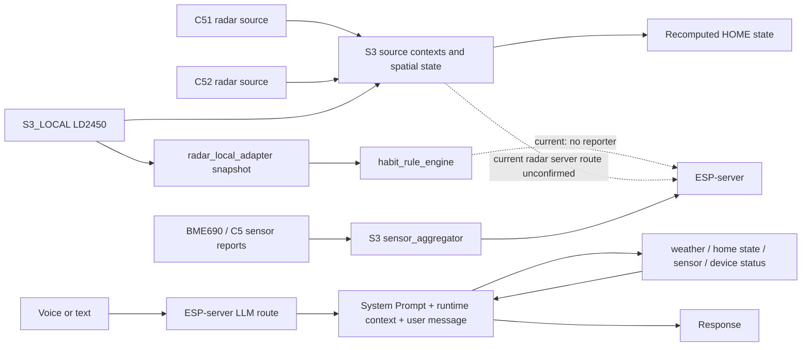

# ESP Home AI Agent 全面架构审计报告

日期：2026-07-20
范围：当前工作区的 `ESP-server` 与 `ESPS3`。只读源码审计；未启动 Server、未执行测试、未读写实际 SQLite 数据库、未 flash/monitor。除本报告外未修改任何文件。

## A. 总体评级

| 维度 | 评级 | 结论 |
| --- | --- | --- |
| 架构健康度 | B- | 三层职责的大方向正确；Agent Tool Loop、SQLite 规则存储、S3 快照消费者均已有可复用边界。当前的同步、事件上报与权限边界尚未闭合。 |
| 当前风险等级 | 高 | 未鉴权的 Habit Rule 写接口和 LLM 接口、S3/Server 规则语义不一致、S3 事件无人消费，会使上线后的配置篡改、错误执行或告警丢失成为现实风险。 |
| 静态可确认 | 高 | 以下文件与行号均来自当前源码。 |
| 需运行/真机验证 | 必须 | S3 的实际堆栈余量、雷达状态抖动下的事件行为、联网工具可靠性、上云链路和鉴权部署配置不能由静态源码证明。 |

## 审计范围与事实边界

- 当前主树只有 `ESP-server/src/prompts/esp-home-agent-system-prompt.txt`；`esp_home_agent_system.md` 只存在于 `分支项目/ESP1`，不是当前实现。
- 工作区在审计前已存在大量未提交/未跟踪修改。本报告不把它们归因于本次审计，也不对其来源作判断。
- “当前实现”与“未来设计占位”严格区分：版本接口、`load_remote_rule()`、规则页面的说明都不能视为已完成 S3 规则同步。

## B. 已正确部分

### 1. LLM Agent 与天气工具

- 固定 System Prompt 只包含角色与实时数据规则，没有把天气、传感器读数、位置或用户消息写死其中；`runAgentConversation()` 分别建立固定 Prompt、动态上下文和 user message（`ESP-server/src/agent/agentRunner.js:33-43`）。
- Prompt 明确规定实时天气/家庭/传感器/设备状态必须调用对应工具，工具失败或无可靠数据时必须说明不可用（`ESP-server/src/prompts/esp-home-agent-system-prompt.txt:11-17`）。
- Tool Registry 拒绝重名/无 handler 工具、把函数 JSON Schema 提供给模型，并在执行前拒绝未知工具、非 JSON 和非对象参数（`ESP-server/src/agent/toolRegistry.js:1-60`）。
- Tool Calling Loop 会把模型 tool call 与工具结果按 `assistant`/`tool` 消息对回传，并有轮数上限，避免无限模型循环（`ESP-server/src/agent/agentRunner.js:45-76`）。
- `weather_query` 每次直接访问 OpenWeather current 和 forecast 端点，没有本地天气缓存；缺少 key、位置、网络、超时、HTTP 失败或 forecast 失败均返回 `success:false`，不以旧值代替实时数据（`ESP-server/src/agent/weatherQuery.js:78-138`）。
- `home_state_query`、`sensor_query`、`device_status_query` 已作为独立 Registry 项目实现，后续扩展不需要改 Tool Loop（`ESP-server/src/agent/defaultToolRegistry.js:15-50`）。传感器 stale 会明确失败（`ESP-server/src/agent/homeTools.js:50-64`）。

### 2. Habit Rules Server

- 表采用稳定文本 ID、独立的 type/enabled、JSON 配置与创建/更新时间，并对 `(type, enabled)` 建索引；CRUD 使用参数化 SQL，没有拼接用户输入（`ESP-server/src/db/habitRules.js:1-22`；`ESP-server/src/services/habitRulesService.js:183-219`）。
- 服务层限制规则类型、ID 字符集、文本长度、整数区间、HH:MM 格式，并保证表层 `enabled` 与 `config.enabled` 一致（`ESP-server/src/services/habitRulesService.js:21-124`）。
- checksum 以排序后的规范化规则生成 SHA-256，规则变化会改变 version/checksum；这是未来拉取的合理 change detector（`ESP-server/src/services/habitRulesService.js:161-180`）。
- 已有针对默认规则、CRUD/checksum 和常见非法配置的临时 SQLite 单测源码（`ESP-server/test/habitRulesService.test.js:31-115`）；本次未运行。

### 3. S3 Habit Rule Engine

- 规则引擎没有调用 UART parser、tracker 或改写雷达状态；adapter 只读取 `radar_local_adapter_get_spatial_snapshot()` 的副本（`ESPS3/components/Middlewares/habit_rule_adapter.c:9-29`）。
- 引擎在独立低优先级任务中每 250 ms 拉取快照，雷达本地 adapter 是另一任务（`ESPS3/components/habit_rule_engine/habit_rule_engine.c:219-251`；`ESPS3/components/radar_ld2450/include/radar_config.h:158-160`）。因此没有在 radar task 内做 JSON、HTTP 或规则处理。
- 快照读取由临界区保护，外部消费者获得副本，不直接持有 tracker 内存（`ESPS3/components/Middlewares/radar_domain/radar_local_adapter.c:322-335`）。
- 长停留、长期占用、空房超时都使用每房间的 emitted 标志，只在一次连续状态段内发一次；进入/离开由状态转换触发（`ESPS3/components/habit_rule_engine/habit_rule_engine.c:157-200`）。
- NIGHT_ACTIVITY 在没有可用本地墙钟时跳过并计数，不会以 monotonic time 猜测夜间时段，属于正确的 fail-closed 语义（`ESPS3/components/habit_rule_engine/habit_rule_engine.c:166-175`）。
- 事件 FIFO 是固定 16 项且满时丢弃最旧项并计数，内存占用有上界（`ESPS3/components/habit_rule_engine/habit_rule_engine.c:62-83`）。

### 4. 三层职责的大方向

当前实现符合下列主边界：

- ESP-server 承担 LLM 调用、Web 规则配置、SQLite 存储、OpenWeather 联网工具和页面展示。
- S3 承担本地雷达空间状态、独立规则评估、网络门控与 BME/设备上云聚合。启动顺序也把 habit engine 放在雷达 adapter 成功之后，但不放进 parser（`ESPS3/components/Middlewares/gateway_orchestrator/gateway_orchestrator.c:85-99`）。
- C5 仍通过 S3 的本地协议进入网关；没有在本次新增 Agent Registry 中发现 C5 直连 ESP-server 或 C5 侧 LLM/规则执行。

## C. 必须修复问题

### P0

1. **Habit Rule 的读写和版本 API 完全未鉴权。**

证据：`GET/POST/PUT/DELETE /api/habit-rules` 与 `/version` 直接注册，没有 `requireGatewayAuth` 或用户会话中间件（`ESP-server/src/routes/habitRulesRoutes.js:28-95`）；静态页面也可直接对这些地址发请求。
影响：任何能访问 Server 的人可读取家庭自动化配置、关闭告警、写入恶意规则或删除全部规则。
修复：在公开部署前引入人类管理端认证与授权（至少角色 `habit_rules:read/write`），写操作审计、CSRF/同源策略和速率限制；S3 的设备凭据不能复用为 Web 管理权限。

2. **LLM 文本接口未鉴权且没有速率/并发预算。**

证据：`POST /api/llm/text` 可直接调用 `runAgentConversation()`（`ESP-server/src/routes/llmTextRoutes.js:25-80`），没有认证中间件。
影响：攻击者可消耗 LLM/天气 API 配额，查询被传入模型的家庭位置与设备能力上下文，并把服务作为开放代理使用。
修复：在对外开放前要求已认证用户/已绑定设备身份，按主体设置并发数、请求速率、每日工具预算和端到端 deadline；记录审计 ID，不记录敏感原文或令牌。

3. **网关鉴权在未配置 token 时 fail-open。**

证据：`configuredGatewayTokens()` 为空时 `authenticateGateway()` 返回 `ok:true, auth_required:false`（`ESP-server/src/services/gatewayAuthService.js:93-100`）。虽部分设备路由已使用此中间件，但部署遗漏环境变量即退化为只声明 gateway_id。
影响：设备状态、命令 ACK 等设备接口可被伪造，间接污染 Agent runtime context。
修复：生产模式必须 fail-closed；启动时拒绝缺少设备认证密钥的生产配置，开发模式需显式开关和醒目日志。

### P1

4. **Server 规则模型与 S3 执行模型不兼容，现有配置不能安全同步。**

证据：Server 使用大写 `type`、`config.room`、`threshold_minutes`、`start_time/end_time`（`ESP-server/src/services/habitRulesService.js:3-18, 81-100`）；S3 loader 只识别小写 ID `long_stay`/`empty_timeout`，只读取 `parameters.minutes` 与整数 `night_start/night_end`，并忽略未知项（`ESPS3/components/habit_rule_engine/rule_loader.c:7-47, 67-76`）。S3 也没有按每条规则的 room 过滤。
影响：一旦直接同步，规则可能静默保持默认值、在错误房间执行，或被部分忽略。`PERSON_LEAVE_ROOM.duration_minutes` 也没有 S3 对应延迟实现。
修复：先定义并版本化一个唯一的 wire schema，再实现 Server 编译器（管理模型 -> S3 schema）和 S3 严格校验器。未知字段/规则、非兼容版本、房间映射缺失必须整体拒绝并保留上一份已验证快照。

5. **S3 当前只使用 S3_LOCAL 快照，不是三源 HOME 空间状态。**

证据：habit adapter 只调用 `radar_local_adapter_get_spatial_snapshot()`（`ESPS3/components/Middlewares/habit_rule_adapter.c:13-14`），并由 `dominant_zone_id` 生成 `zone_<id>`（同文件:18-28）。它没有读取 C51/C52 source context 或重算后的 `RadarHomeState`。
影响：预期的 `C51/C52/S3_LOCAL -> S3 spatial state -> habit_rule_engine` 并未成立；C5 侧的人体/房间变化不会进入当前 habit engine，Server 保存的 `bedroom/living_room` 也与 `zone_n` 不一致。
修复：明确规则作用域。若规则面向全屋，adapter 必须消费只读的重算 HOME snapshot；若面向本地 S3 传感器，Server 必须只允许其已映射的 `zone_n`，并在 UI/API 中标明作用域。

6. **Habit event 没有消费者/上云路径，FIFO 最终必然覆盖事件。**

证据：引擎写入 16 项 ring buffer（`ESPS3/components/habit_rule_engine/habit_rule_engine.h:89-103`），当前主树只见 `pop_event` 的定义和 host test 调用，未见运行时 reporter 或 `server_client` 调用（`ESPS3/components/habit_rule_engine/habit_rule_engine.c:203-210`）。
影响：事件只打印日志并在 16 项后丢弃，无法形成“规则执行 -> ESP-server 数据展示/通知”的数据流；使用者容易误以为规则已上报。
修复：先定义事件 envelope（`event_id`、规则版本、源/房间、单调序号、wall-clock quality、去重键），再以独立有界 reporter FIFO 发送。上游满时应有可观测计数、优先级和持久/重试策略，不能阻塞 radar 或 rule task。

7. **NIGHT_ACTIVITY 在真实运行时没有注入时间源，因而始终 fail-closed。**

证据：runtime 默认使用 `habit_time_provider_unavailable`（`ESPS3/components/habit_rule_engine/habit_rule_engine.c:110-126`）；接口存在 `habit_rule_engine_runtime_set_time_provider()`，但当前主树没有调用点；占位 provider 总是返回 false（`ESPS3/components/habit_rule_engine/time_provider.c:5-10`）。
影响：该默认启用规则永远不产生夜间事件，且每次进入可能打印 skip 日志。
修复：接入已同步、带时区/有效性状态的 S3 时间服务；未同步时保持 skip 并用限频诊断。同步后的跳变、DST/时区、跨午夜窗口必须有真机测试。

8. **动态上下文的隐私最小化和提示注入防护不足。**

证据：每次 Agent 请求都会将 home location、所有 device ID、capabilities JSON、last_seen 作为 system-role 文本发送给上游 LLM（`ESP-server/src/agent/contextBuilder.js:14-32`；`ESP-server/src/agent/agentRunner.js:36-43`）。capabilities 来自设备上报，未见 allowlist/转义/可信度标记。
影响：不需要位置或设备清单的问题也会泄露家庭元数据给 LLM 服务；被污染的设备 capability 字符串可成为间接提示注入载体。
修复：只在工具确有需要时最小化传递数据；将设备元数据做字段 allowlist、长度限制与数据来源标记；把用户/设备可控文本视为不可信 data，禁止其改变工具权限或输出策略。

### P2

9. **Tool Loop 的“3 轮”存在执行次数偏差，且没有全链路 deadline。**

证据：循环是 `round <= MAX_TOOL_ROUNDS`，每次含 tool call 都会实际 invoke，故 `MAX_TOOL_ROUNDS=3` 最多可执行 4 轮工具，最后一轮结果不会再交给模型（`ESP-server/src/agent/agentRunner.js:10, 46-76`）。单次模型超时为 30 秒（`ESP-server/src/llm/textClient.js:1-6`）。
影响：不是无限循环，但会浪费一次工具调用；并发下请求时间和外部 API 成本不可控。
修复：以 `toolRounds < MAX_TOOL_ROUNDS` 或总 tool-call 计数实现精确上限，设置覆盖 LLM 与所有工具的请求级 timeout/cancellation，并限制单次 tool result/message 总字节数。

10. **Registry 没有在 invoke 前执行 JSON Schema 校验。**

证据：Registry 仅验证 JSON 是否对象，然后直接调用 handler（`ESP-server/src/agent/toolRegistry.js:33-53`）。
影响：现有 handlers 自行防守，未来新增工具容易漏掉类型、必填字段、额外字段或枚举校验。
修复：使用一个服务器端 JSON Schema validator；每个 handler 仍保留业务授权和 freshness 校验，不能信任 LLM 参数。

11. **规则存储缺少发布契约所需的兼容性与并发字段。**

证据：表仅含 id/name/type/enabled/config/timestamps（`ESP-server/src/db/habitRules.js:1-9`）；version 是请求时从全表导出的 hash（`ESP-server/src/services/habitRulesService.js:161-180`）。
影响：checksum 可发现变化，但不能描述目标 S3、schema/dialect、最低 firmware/protocol、发布状态、回滚版本或冲突写入。
修复：新增独立 immutable `rule_bundle`/`publication` 概念，至少含 `schema_version`、`target_scope`、`target_gateway/device`、`min_firmware_version`、`min_protocol_version`、`bundle_version`、checksum、created/published/activated 状态和 ETag/If-Match。规则编辑需乐观并发控制与变更审计。

12. **S3 默认规则与事件抗抖/溢出观测不足。**

证据：默认所有规则启用，且 defaults 的阈值为 30/10/120 分钟（`ESPS3/components/habit_rule_engine/rule_loader.c:20-30`）；ring 溢出只计数并覆盖最旧项（`habit_rule_engine.c:66-71`）。
影响：在无人消费前默认启用只会制造日志与丢失事件；雷达 occupancy 边界抖动会重复产生进入/离开事件，当前没有 rule event id、冷却窗口或跨重启去重。
修复：在事件上报闭环完成前默认禁用或仅启用纯本地安全动作；按规则增加 cooldown/debounce 和 source sequence 去重，暴露 FIFO 深度/丢弃数；以真机回放验证抖动场景。

## D. 建议优化但不急问题

- **System Prompt/Runtime Context/User Message：** 源码层已分成三个构造步骤，但 runtime context 仍使用第二条 `system` 消息。若上游支持 developer/structured context，应采用明确的受信上下文通道，并建立字段分类（静态策略、会话元数据、实时工具结果、用户输入）。当前没有把实时状态写入固定 Prompt 的证据。
- **工具真实性：** `weather_query` 是真实工具；其他三个工具均查询 ESP-server 已存数据，名称“current/fresh”应附带采样/last_seen 时间和 freshness 状态，避免模型把“数据库最新”表述成“设备实时”。`home_state_query` 已正确声明 online 不是有人（`ESP-server/src/agent/homeTools.js:30-47`）。
- **天气响应校验：** current/forecast 均 HTTP 200 但 payload 缺关键字段时仍可能 `success:true` 并返回 null/空字符串。应验证坐标、时间戳、主要天气字段与 forecast 数组，再决定成功。
- **SQLite 规模：** 对目前少量规则，SQLite 足够；`listHabitRules()` 全表读取并 hash 的设计仅适用于小规模。后续多家庭/多网关时，应按 scope 索引、分页管理 API，并把发布 bundle 缓存为物化快照。
- **规则初始化：** 默认规则 ensure 是逐条查询/插入且无事务（`ESP-server/src/services/habitRulesService.js:222-230`）。单实例启动问题不大，多实例并发启动应使用事务或 `INSERT ... ON CONFLICT`。
- **S3 实时性：** habit task 不阻塞在 HTTP/JSON，但 snapshot 的临界区复制完整 spatial struct；应以目标板 profile 测量临界区、radar task high-water mark、`generated_events/dropped_events`，不要只凭静态阅读宣称无实时性影响。
- **命令安全演进：** 当前 Agent Registry 不含设备控制 tool，S3 的 smart-home gateway 在无真实设备时明确 ACK failed（`ESPS3/components/Middlewares/smart_home_gateway/smart_home_gateway.c:52-105`），不存在本次 Agent 直接控制设备的假承诺。增加控制工具前必须设置 server-side command allowlist、设备 capability allowlist、目标绑定、参数范围、幂等键、用户确认与真实 ACK；不能让 LLM 文本直接成为设备动作。

## 数据流审计

**结论：** 预期的 `C51/C52/S3_LOCAL -> S3 spatial state -> habit_rule_engine -> ESP-server` 只有前半段的 spatial architecture 可见；当前 habit engine 实际走的是 `S3_LOCAL -> local snapshot -> habit engine`，且后半段无 event reporter。没有发现 habit event 回流到雷达 parser/tracker 的环路。BME 的 S3 聚合上云调用 `server_client_post_gateway_snapshot_json()` 可见（`ESPS3/components/Middlewares/sensor_aggregator/sensor_aggregator.c:710-716`），但本次不启动 Server，不能声称端到端成功。

## E. 下一阶段开发建议

1. 先完成 P0：统一生产 fail-closed 鉴权，保护 LLM 与规则管理 API，并为密钥配置增加启动检查、轮换与审计。
2. 冻结并评审 `habit-rule-bundle/v1` wire schema：明确 rule ID、scope、房间/zone 映射、duration、time zone、schema/firmware compatibility、checksum、签名/鉴权与原子回滚语义。
3. 实现单向、拉取式 `ESP-server -> S3` 同步：metadata/ETag 检查 -> 下载 bundle -> 严格验证 -> 写入双缓冲/持久化 -> 原子激活 -> ACK 带 bundle version/checksum。任何失败保持旧 bundle，绝不部分应用。
4. 将 habit adapter 接到明确选择的 HOME snapshot 或显式 local scope；先补 C51/C52/S3_LOCAL 多源回放测试，再发布全屋规则。
5. 增加独立 event reporter：有界 FIFO、事件 ID/去重、优先级、离线策略、drop metrics；随后再展示到 ESP-server。不要让 reporter 运行在 radar/habit task。
6. 为 Agent 增加端到端预算、schema validation、最小化 runtime context，以及工具结果的 freshness/来源标签。设备控制工具必须在完整 allowlist、授权与 ACK 闭环后才开放。
7. 最后做运行验证：临时 SQLite API 回归、假 OpenWeather 超时/失败测试、S3 host tests、固件 build、雷达抖动回放、实际时间同步与断网/重连验证。它们只能证明各自层级，不能替代真机/真实服务验收。
