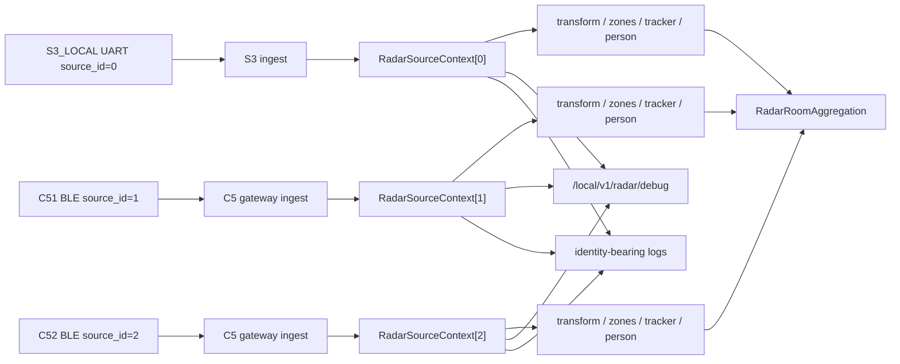

# Radar Architecture Audit

Date: 2026-07-19

## Scope

This audit covers the three LD2450 sources and the local macOS debug tool:

| Source | source_id | device_id | room | transport |
| --- | ---: | --- | --- | --- |
| S3_LOCAL | 0 | sensair_s3_gateway_01 | s3_local | S3 UART |
| C51 | 1 | sensair_shuttle_01 | living_room | C5 BLE -> HTTP |
| C52 | 2 | sensair_shuttle_02 | bedroom | C5 BLE -> HTTP |

The audit did not flash devices, open a serial monitor, or start ESP-server.

## Findings And Repairs

1. Input and processing state could be interpreted as one latest radar state. A fixed `RadarSourceContext[0..2]` now owns raw targets, filtered targets, tracker state, person continuity, history, spatial state, diagnostics, coordinate configuration, snapshot, sequence, and online state.
2. S3 ingest and the C5 gateway now resolve the source before storing a frame. Remote samples are bound to source 1 or 2; the S3 UART adapter is bound to source 0.
3. Tracker, coordinate, zone, spatial, and person state are allocated inside each context. No source shares a target buffer, tracker pointer, person pointer, history array, snapshot, or diagnostics object.
4. HOME aggregation no longer selects an `active_source` or `active_room`. `RadarRoomAggregation` reports occupied rooms only and cannot write back into a source context.
5. Firmware logs now use source-bearing event labels: `RADAR_RX_FRAME`, `RADAR_TRACK_UPDATE`, `RADAR_PERSON_UPDATE`, `RADAR_ROOM_STATE`, and `RADAR_HOME_AGGREGATION`. Every source log includes `source_id`, `source`, `device_id`, `room`, and `sequence`.
6. The debug API returns three source objects, each with identity, transport, sequence, targets, and source-local counts. It no longer returns a top-level flattened target list.
7. The macOS tool stores room state as `[Int: RadarState]`; source IDs 0, 1, and 2 are updated independently, with UNKNOWN kept outside room panels.

## Data Flow

## Key Files

- `ESPS3/components/Middlewares/radar_domain/include/radar_source_context.h`
- `ESPS3/components/Middlewares/radar_domain/radar_source_context.c`
- `ESPS3/components/Middlewares/radar_domain/radar_gateway_ingest.c`
- `ESPS3/components/Middlewares/radar_ingest/radar_ingest.c`
- `ESPS3/components/Middlewares/radar_domain/radar_registry.c`
- `ESPS3/components/Middlewares/radar_domain/radar_log_manager.c`
- `ESPS3/components/Middlewares/local_http_server/radar_local_handler.c`
- `ESPS3-Radar-Debug/Sources/Models/RadarModels.swift`
- `ESPS3-Radar-Debug/Sources/Services/RadarLogParser.swift`
- `ESPS3-Radar-Debug/Sources/Stores/RadarStateStore.swift`

## Verification

| Check | Result |
| --- | --- |
| `sh ESPS3/components/Middlewares/radar_domain/tests/run_host_tests.sh` | PASS |
| `sh ESPC51/components/radar_ld2450/tests/run_host_tests.sh` | PASS |
| `sh ESPC52/components/radar_ld2450/tests/run_host_tests.sh` | PASS |
| `sh ESPS3-Radar-Debug/script/run_parser_checks.sh` | PASS |
| `swift build` in `ESPS3-Radar-Debug` | PASS |
| `idf.py -C ESPS3 -B /tmp/radar-architecture-s3 build` | PASS |
| `idf.py -C ESPC51 -B /tmp/radar-architecture-c51 build` | PASS |
| `idf.py -C ESPC52 -B /tmp/radar-architecture-c52 build` | PASS |
| `git diff --check` | PASS after the isolation-test changes; rerun in final validation |

Firmware artifacts:

- S3 `sensair_s3_gateway.bin`: `0x122f40`; smallest app partition `0x700000`, `84%` free.
- C51 `00_Learn.bin`: `0x1ac7d0`; app partition `0x500000`, `67%` free.
- C52 `00_Learn.bin`: `0x1ac7e0`; app partition `0x500000`, `67%` free.

## Resource Review

Static source review keeps large radar task stacks and buffers in PSRAM where the platform API permits it. S3 stack sizes are UART RX 4096 words, local adapter 8192 words, diagnostics 4096 words, ingest worker 4096 words, and log manager 6144 words. C5 worker and upload stacks are 4096 and 3072 words. S3 ingest history, diagnostics workspace, local adapter workspace, and C5 history are PSRAM allocations. Runtime heap high-water and task high-water values remain observable through existing bounded logs, but no device runtime session was claimed here.

## Acceptance Boundary

The evidence above proves host behavior, parser behavior, Swift compilation, static integration, and three target builds. It does not prove live UART bytes, BLE address type/GATT handles/CCCD notification, RF calibration, 30-minute stability, or server/database behavior.
