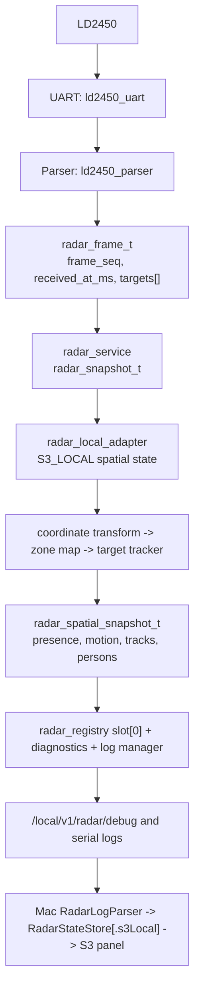
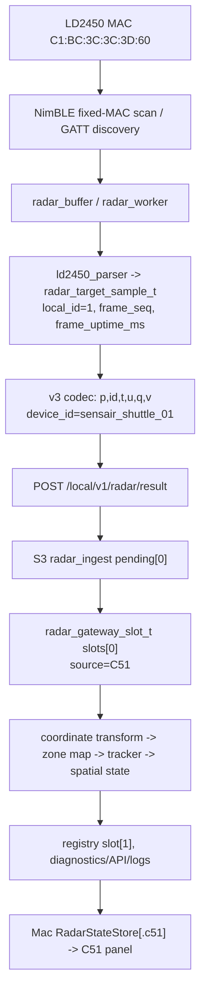
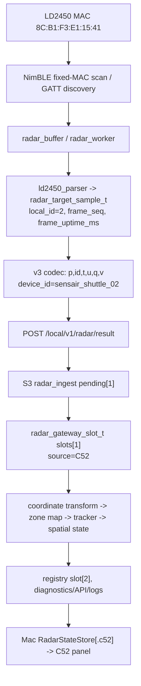

# Radar End-to-End Data Flow Audit

Audit date: 2026-07-19

Scope: `ESPS3`, `ESPC51`, `ESPC52`, and `ESPS3-Radar-Debug`. This is a source
and host-test audit. It does not prove a physical UART/BLE/GATT connection.

## Canonical Identities

| Source | Numeric ID | Device ID | Registry room | Transport |
| --- | ---: | --- | --- | --- |
| S3_LOCAL | 0 | `sensair_s3_gateway_01` | `s3_local` | S3 UART |
| C51 | 1 | `sensair_shuttle_01` | `living_room` | LD2450 BLE -> C51 -> HTTP |
| C52 | 2 | `sensair_shuttle_02` | `bedroom` | LD2450 BLE -> C52 -> HTTP |

The authority for this mapping is the S3 registry:
`ESPS3/components/Middlewares/radar_domain/radar_registry.c`.

## S3_LOCAL Flow

| Step | Primary structure | Identity carried or derived |
| --- | --- | --- |
| UART/parser | `ld2450_parser_t`, `radar_frame_t` | `frame_seq`, `received_at_ms`; source is implicit because this component is only S3 UART |
| service | `radar_snapshot_t` | frame sequence/timestamps; no `device_id`/`room_id` in the struct |
| adapter | static `radar_spatial_state_t s_spatial_state` | explicitly sets source 0 |
| registry | `radar_registry_entry_t s_slots[3]` | source/device/room/sequence/timestamp all available |
| logs/API | registry snapshot plus spatial snapshot | source/device/room are intended to be emitted or derived |

## C51 Flow

The C51 codec includes `device_id`, `id=1`, request uptime `u`, request sequence
`q`, `frame_seq`, and `frame_uptime_ms`. S3 rejects a device ID that does not
match `local_id=1`.

## C52 Flow

The source and device mapping are fail-closed in the v3 parser:
`local_id=2` is accepted only with `sensair_shuttle_02`.

## Isolation Boundaries

| Boundary | Isolation mechanism | Audit result |
| --- | --- | --- |
| C51 vs C52 BLE | Distinct compiled MAC constants and local IDs | Source-level pass; address type/GATT must still be measured on hardware |
| C51 vs C52 pending ingress | `s_pending[local_id - 1]` | Pass |
| C51 vs C52 tracking | `s_slots[local_id - 1].spatial` | Pass |
| S3 local vs remote tracking | `s_spatial_state` vs gateway `s_slots[0..1].spatial` | Pass |
| registry/diagnostics | source-indexed `s_slots[3]` and snapshots | Pass |
| accepted-frame history | one global ring with `local_id` per entry | Identity retained, but retention capacity is shared across C51/C52 |
| detailed log manager | source-indexed storage but publication gates on S3_LOCAL | C51/C52 detailed track logs are suppressed |
| sequence domains | per-slot request/frame sequence tracking | Pass; equal sequences across sources are valid |
| room calibration | Three independent state instances, but each starts from the same default installation config | Configuration isolation incomplete |
| Mac state | Dictionary keyed by `RadarSource` with three panels | Pass for normal records; compact-track branch has a source-loss defect |

## Contract Matrix

| Field | C5 parser/sample | C5 v3 JSON | S3 ingress/gateway | S3 registry/API | Mac parser/store |
| --- | --- | --- | --- | --- | --- |
| source | implicit board | encoded as `id` only | derived from `local_id` | explicit name/id | source, source_id, device ID, or tag |
| device_id | board constant | explicit | validated against local ID | explicit | parsed, but not validated against source |
| room_id | binding config only | absent | derived only at registry | explicit in diagnostics; not all API arrays | not parsed from logs into state |
| timestamp | receive/frame uptime | `u`, `frame_uptime_ms` | S3 receive time | report time | receive time owns freshness |
| sequence/frame_id | parser frame sequence | `q`, `frame_seq` | per-source ordering | `entry.sequence` | per-source de-duplication |
| coordinates | mm, speed cm/s | `x_mm`, `y_mm`, `velocity_cm_s` | mm/cm-s preserved | spatial mm/cm-s | mm internally; displays metres |
| angle/presence/motion | angle not in C5 JSON | absent | calculated on S3 | present in spatial state/logs | logs support angle/presence/motion |

The intentional C5/S3 ownership split means angle, presence, and motion are not
C5 v3 input fields. The protocol is not a full end-to-end field-preserving
contract for those values; they originate at S3.
