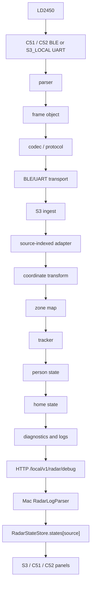

# Radar Full End-to-End Isolation Audit

Audit date: 2026-07-19
Scope: `ESPS3`, `ESPC51`, `ESPC52`, `ESPS3-Radar-Debug`
Excluded: coordinate transform, zone map, tracker core algorithm, ESP-server,
BME, voice, and command modules.

## Verdict

The software path now has source-indexed state at every S3 and Mac stateful
boundary. C51 and C52 use separate pending slots, spatial states, histories,
registry entries, and Mac room states. Explicit source/device/room conflicts are
rejected or routed to `UNKNOWN`; they cannot update a room panel.

Hardware acceptance remains separate: this audit does not prove BLE address
type/GATT/CCCD/Notify, UART reception, installation calibration, or live Mac
rendering. Those require measured device logs and a flashed runtime cycle.

## Canonical Identity Registry

| source_id | source | device_id | room_id | ingress |
| ---: | --- | --- | --- | --- |
| 0 | `S3_LOCAL` | `sensair_s3_gateway_01` | `s3_local` | S3 LD2450 UART |
| 1 | `C51` | `sensair_shuttle_01` | `living_room` | C51 BLE -> HTTP |
| 2 | `C52` | `sensair_shuttle_02` | `bedroom` | C52 BLE -> HTTP |

The S3 registry in `ESPS3/components/Middlewares/radar_domain/radar_registry.c`
is the authoritative mapping. Mac defaults mirror this table.

## End-to-End Data Flow

## Field Audit Matrix

| Layer | source_id | device_id | room_id | sequence | timestamp | track_id |
| --- | --- | --- | --- | --- | --- | --- |
| LD2450/parser | implicit by physical endpoint | binding/registry | binding/registry | frame sequence | frame uptime/receive time | target slot |
| C5 frame object | `local_id` | binding-derived | binding-derived | `frame_seq`, request `q` | `frame_uptime_ms`, request `u` | target slot |
| C5 v3 codec | `id` | explicit `device_id` | explicit `room_id` | `q`, `frame_seq` | `u`, `frame_uptime_ms` | `target_id` |
| S3 JSON parser | validated from `id` | exact registry match | exact registry match | request/frame sequence | S3 receive time plus frame uptime | target slot |
| S3 pending ingest | array index 0/1 | source registry | source registry | per-source latest-only | receive time | target slot |
| gateway/local adapter | dedicated context | registry | registry | spatial frame sequence | captured/latest frame | tracker ID |
| tracker/person | context-owned | context-owned via source | context-owned via source | context-owned | context-owned | track/person IDs |
| home aggregation | recomputed over all sources | active source lookup | active room lookup | latest report | transition/report time | not aggregated |
| diagnostics/logs | printed on every source record | printed from registry | printed from registry | included where applicable | `timestamp_ms`/age | track/person IDs |
| HTTP debug API | each target/source object | each source object | each source object | source summary | `last_update` | each target `id` |
| Mac parser/store/view | strict source binding | fixed per-source | fixed per-source | per-state last sequence | receive time owns freshness | per-state tracks/history |

The C5-to-S3 boundary intentionally keeps spatial semantics (angle, presence,
motion, zone) owned by S3. Room identity is now explicit in v3 JSON and is
validated against the S3 registry before a frame is accepted.

## Isolation Findings

### Firmware state

- `radar_gateway_ingest.c` owns `s_slots[2]`; every slot contains its own
  spatial state, rate manager, sample, sequence, and output.
- `radar_local_adapter.c` owns the separate S3 local spatial state and writes
  registry source 0 only.
- `radar_ingest.c` has one overwriteable pending slot and a 32-entry history
  ring per remote source, so C51 cannot evict or replace C52 history.
- `radar_registry.c` owns `s_slots[RADAR_SOURCE_COUNT]`; person counts,
  presence, tracks, histories, and diagnostics are copied per source.

### HOME aggregation

`radar_registry_get_home_presence()` recomputes on read. It counts only online
occupied sources, prefers `MOTION`/`PRESENT` over a stale `HOLD`, and uses the
latest report as a tie breaker. It never selects a source from initialization
order or the last registered source. `RADAR_HOME` includes the emitting source
identity and the active source/device/room.

### Logs

`RADAR_STATE`, `RADAR_TRACK`, `RADAR_TRACK_COMPAT`, `RADAR_TRACKER`,
`RADAR_COUNTS`, `RADAR_PERSON_*`, `RADAR_REMOTE_RADAR_*`, local diagnostics, and
HOME records now carry source identity from the registry. No `last_device_id`,
`global_device`, or `cached_room` lookup remains in the audited radar paths.

### HTTP/API

`/local/v1/radar/debug` returns three independent source objects. Each object
contains `source_id`, `source`, `device_id`, `room`, a nested `targets` array,
`target_count`, count summaries, and `last_update`. The legacy top-level target
array remains source-tagged for compatibility; it is not used as a shared
snapshot by the Mac tool.

### Mac Debug Tool

- `RadarStateStore` is keyed by `Dictionary<RadarSource, RadarRoomState>`.
- Each state owns tracks, history, device ID, room ID, counts, sequence, and
  freshness timestamps.
- Target events are forcibly scoped to the event source; mismatched target
  source/device/room records become `UNKNOWN` diagnostics.
- Implicit recent-source fallback is limited to legacy S3-local records.
  Remote C51/C52 diagnostics without an explicit source are rejected, so a
  source change cannot overwrite the previous room.
- Dashboard panels bind only to `.s3Local`, `.c51`, and `.c52` state entries.

## Residual Runtime Gates

The following are intentionally not inferred from builds or host tests:

1. Measured BLE address type, service/characteristic handles, CCCD subscription,
   and Notify traffic for C51/C52.
2. Flashed S3 UART reception and a simultaneous C51/C52 HTTP ingest cycle.
3. Per-device mount calibration and live coordinate/zone acceptance.
4. Live Mac serial rendering from all three physical sources.
