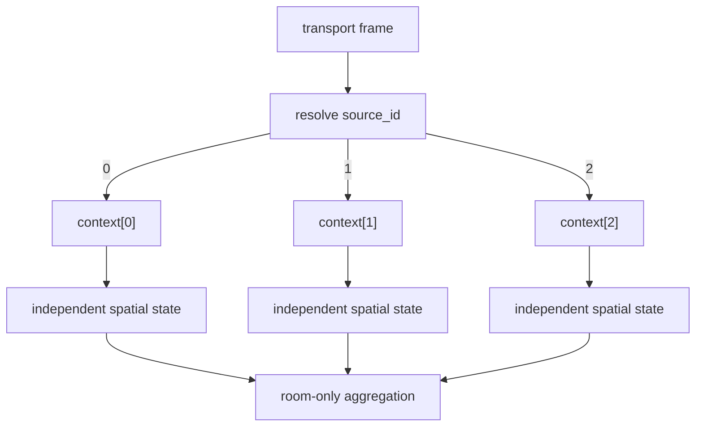

# Radar Source Isolation Fix

Date: 2026-07-19

## Fixed Model

`RadarSourceContext` is the only source-owned boundary for the three physical radars. The fixed mapping is:

```text
context[0] = S3_LOCAL / sensair_s3_gateway_01 / s3_local / UART
context[1] = C51      / sensair_shuttle_01   / living_room / C5 BLE
context[2] = C52      / sensair_shuttle_02   / bedroom     / C5 BLE
```

Each context contains:

```text
source_id, source_name, device_id, room_id, transport_type,
online_state, last_frame_time, raw_targets, filtered_targets,
tracker_state, person_state, spatial_state, diagnostics_state,
coordinate_config, history, snapshot, sequence, frame_sequence
```

The tracker and person pointers are aliases into that context's spatial storage. This prevents a second owner from drifting away from the source boundary.

## Changes

- S3 UART frames are processed by the source-0 context.
- C51/C52 gateway slots retain a context pointer and process source-1/source-2 frames independently.
- Pending S3 ingest items retain the resolved context, so a later worker cannot use a global latest frame.
- Coordinate installation, origin, rotation, zone map, tracker history, person continuity, and diagnostics are per context.
- `RadarRoomAggregation` reads the three source states and emits only occupied rooms. It never mutates a source.
- `/local/v1/radar/debug` emits three source objects with source-local targets and count summaries.
- C51/C52 implementations remain byte-identical except for their binding configuration headers.

## Isolation Proofs

The S3 host fixture injects target positions `x=100`, `x=200`, and `x=300` into S3_LOCAL, C51, and C52. It verifies that raw targets, filtered targets, tracker state, person state, history, snapshot, diagnostics, and coordinate configuration addresses are distinct, and that the source sequences remain independent.

The registry fixture then makes C51 and C52 occupied while S3_LOCAL is vacant. It verifies:

```text
occupied_room_count = 2
occupied_rooms[0] = C51 / living_room
occupied_rooms[1] = C52 / bedroom
C51 business_person_count = 2
C52 business_person_count = 1
S3_LOCAL business_person_count = 0
```

## Data Flow



## Tests And Builds

- S3 radar-domain host suite: PASS, including protocol, registry, gateway, source isolation, spatial, recovery, and ingest tests.
- C51 and C52 LD2450 host suites: PASS.
- S3 firmware build: PASS, `sensair_s3_gateway.bin` `0x122f40`, `84%` app partition free.
- C51 firmware build: PASS, `00_Learn.bin` `0x1ac7d0`, `67%` app partition free.
- C52 firmware build: PASS, `00_Learn.bin` `0x1ac7e0`, `67%` app partition free.

No flash or serial monitor acceptance was performed.
