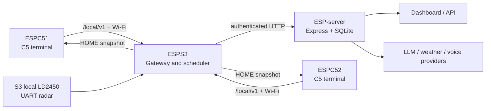

# ESP 智能家居主项目：GPT 协作上下文

**生成时间：** 2026-07-21  
**工作区：** `/Users/zhiqin/ESP 部分开发`  
**目的：** 本文是给新加入的 GPT/Agent 的项目事实底稿。先读本文，再只读检查目标目录和当前 Git 状态；不能将历史副本、旧报告或 dirty worktree 当作已发布基线。

## 0. 给协作 Agent 的启动指令

1. 当前主项目范围只包括顶层 `ESPC51/`、`ESPC52/`、`ESPS3/`、`ESP-server/`，以及顶层 `docs/`、`tools/`。`分支项目/`、`archive/` 是历史/实验参考，默认禁止修改。
2. 顶层仓库当前在 `half...origin/half`，HEAD 为 `6c369e6`（2026-07-20）。工作树已有大量用户改动和构建产物，**不得**用 `git reset`、`git checkout --`、清理未跟踪文件或覆盖 C51/C52 的既有差异。
3. `ESP-server/` 是独立 Git 仓库，当前在干净的 `new1...origin/new1`，HEAD `1a3b033`。它不是顶层 `half` 变更的一部分。提交、测试、发布都必须分别在正确 Git 根执行。
4. C51/C52 是同一 C5 终端模型的镜像实现。除设备身份、绑定或明确板级配置外，涉及运行逻辑的修改必须保持两端对齐，并检查目标文件的定向 diff。
5. 先确认数据所有权与协议契约，再改代码。C5 不直连 ESP-server；S3 是 C5 本地协议的终点和上云唯一网关。不要让 C5 承担 HOME 聚合、LLM 或服务端业务。
6. 验证结论必须分层写明：静态/host test、ESP-IDF build、已 flash/串口、真实 C5-S3-Server 端到端。这些不能互相替代。

## 1. 项目目标与总体形态

这是一个多芯片智能家居/环境感知系统：两台 ESP32-C5 终端负责近端传感、语音、BLE 雷达和 LCD 交互；一台 ESP32-S3 作为本地 Wi-Fi 网关、协议边界、空间状态与任务调度中心；Node/Express/SQLite 的 ESP-server 提供设备数据、语音/LLM、规则管理和 Dashboard。



## 2. 真源目录与非主路径

| 路径 | 定位 | 当前事实 |
| --- | --- | --- |
| `ESPC51/` | 第一台 ESP32-C5 终端，ESP-IDF 项目 `00_Learn` | 主实现；有未提交改动 |
| `ESPC52/` | 第二台对等 ESP32-C5 终端，ESP-IDF 项目 `00_Learn` | 主实现；有未提交改动 |
| `ESPS3/` | ESP32-S3 网关，ESP-IDF 项目 `sensair_s3_gateway` | 主实现；有未提交改动 |
| `ESP-server/` | Node.js/Express 5 + SQLite3 单体服务与 Dashboard | 独立 Git 根，`new1`，当前干净 |
| `shared_components/` | 共享协议/组件参考 | 改动前先确认实际被哪个目标引用 |
| `tools/` | 调试与辅助工具 | 不等同于固件生产路径 |
| `ESPS3-Radar-Debug/` | SwiftPM macOS 雷达调试器 | 独立但无有效提交，不能作为发布事实 |
| `分支项目/ESP1/`、`分支项目/ESP/`、`分支项目/ESP 雷达/` | 旧分支、实验或迁移副本 | 默认只读；其中的 ESP-server 不是主 `new1` 服务 |

顶层仓跟踪的是聚合文件树，不存在 mode `160000` gitlink；但工作区内有多个嵌套 `.git`。执行 Git 操作前，务必先定位 Git 根，避免把某个历史副本误提交或误推送。

## 3. 板级职责与边界

### ESPC51 / ESPC52：C5 终端

- 入口为 `main/main.c`，创建短生命周期 `app_startup` 任务，再交由 `app_orchestrator_start()` 编排。
- 负责 Wi-Fi 接入 S3 SoftAP、本地系统注册/心跳/状态、BME/传感采集、麦克风/扬声器、唤醒词、语音回合、BLE 雷达与 LCD/LVGL 显示。
- 通过共享 `esp111_protocol_common` 使用 S3 的 `/local/v1/*` 协议：注册、heartbeat、status、sensor、radar、voice、命令和 HOME snapshot。
- `voice_chain`、`local_wake_word`、`server_voice_client`、`c5_resource_manager` 共同管理语音独占期。`VOICE_EXCLUSIVE` 租约、wake prepare 与 I2S/DMA 生命周期是高风险并发区。
- C5 会以只读、周期轮询方式拉取 S3 的 `/local/v1/radar/home_snapshot`，供 LCD/本地展示使用；解析失败只保留旧快照，不可反向写 S3 状态。
- 允许的 C51/C52 差异主要是设备绑定：C51 为 `local_id=1`、`sensair_shuttle_01`、`living_room`，C52 为 `local_id=2`、`sensair_shuttle_02`、`bedroom`，以及各自的雷达 BLE MAC/板级配置。普通业务逻辑不得借此分叉。
- 不负责：跨设备 HOME 解释、ESP-server 聚合协议、LLM、Server 规则下发或 S3 队列调度。

### ESPS3：网关和本地调度中心

- 入口为 `main/main.c` 的 `gateway_startup` 任务，随后 `gateway_orchestrator_start()` 按依赖启动网络、HTTP、传感、调度和语音模块。
- 负责 SoftAP/STA、C5 子设备注册表、本地 HTTP、S3 本地 LD2450 UART 雷达、`RadarSourceState -> RadarHomeState` 空间聚合、命令路由、网络队列、离线/重放、BME 缓存、环境告警、语音代理和 Server 上行。
- 本地协议在 `local_http_server` / `protocol_adapter` 结束；S3 到 Server 的完整 HTTP 在 `server_client` 结束。C5 不得绕过 S3 访问 Server。
- 启动编排把可选传感/规则/诊断模块作为可降级服务记录；网关核心不应因单个传感器失败而重启。
- `s3_scheduler` 负责运行时 cadence/backpressure；不要在 orchestrator 或 radar parser 内塞入网络、JSON 或 LLM 工作。

### ESP-server：持久化和外部服务

- `server.js` 是入口：加载环境变量、执行 SQLite additive migrations、挂载所有路由、服务 `public/` Dashboard。
- 技术栈：Node.js、Express 5、`sqlite3`、`dotenv`、`cors`；主数据默认在 `ESP-server/db/database.db`，测试应通过 `ESP_SERVER_DB_PATH` 使用临时库，禁止读写真实库。
- 承担设备 ingest、状态/命令、Dashboard、事件、智能家居、语音回合、LLM、记忆、天气、Habit Rules/Events 等 API；兼容旧 `/sensor`、`/asr`、`/llm` 路径。

## 4. 关键数据流与契约

### 4.1 C5 到 S3

共享协议头定义在各目标的 `components/esp111_protocol_common/include/esp111_protocol_common.h`。核心路由包括：

- `/local/v1/register`、`/heartbeat`、`/status`、`/sensor`
- `/local/v1/radar/state`、`/radar/result`、`/radar/debug`、`/radar/home_snapshot`
- `/local/v1/voice/turn`、`/voice/prompt-cache`、`/audio/wake-prompt`
- `/local/v1/commands/pending`、`/local/v1/commands/*/ack`

`RadarHomeState` 是 S3 聚合后的 HOME 真相，来源可含 C51、C52、S3 本地雷达；`radar_home_snapshot_get()` 对外返回副本。消费者不能持有或修改 tracker/registry 内存。

### 4.2 S3 到 Server

- S3 通过 `server_client` 上行 gateway snapshot、设备状态、BME/环境数据、CSI、命令 ACK、智能家居事件、语音回合代理等。
- CSI 走严格的 `POST /kernel/csi_event` CanonicalEvent v2 契约；gateway 身份来自可信 header/binding，不应擅自把额外键塞入严格 body。
- `voice_proxy` 使 C5 的 PCM 回合经 S3 流式转发到 `POST /api/voice/turn`，S3 保持单 session/有界队列，并在结束时释放 `voice_busy`。
- S3 规则事件由独立 `habit_event_reporter` 发送到 `POST /api/habit-events`；其必须保留失败队首、指数退避，绝不阻塞 radar 或 habit task。

### 4.3 LLM Agent

- `POST /api/llm/text` 和 `/api/llm/structured` 通过 Agent Runner 调用 OpenAI-compatible LLM。
- Agent 将固定系统提示、动态上下文与用户消息分离；工具注册表提供 weather、home state、sensor、device status。
- 实时数据必须由工具获得；工具失败、数据缺失或 stale 时应明确 unavailable/error，不能以缓存或模型猜测伪造实时状态。
- 设备能力、位置和用户/设备文本均是敏感或不可信输入：新增工具/上下文前做字段 allowlist、长度限制、权限判断和最小化传递。

### 4.4 Habit Rule Bundle 和事件

- Server 管理模型生成 `habit-rule-bundle-v1`：`habitRuleBundleCompiler.js` 对 canonical JSON 做 SHA-256 checksum，支持六类规则。
- `GET /api/habit-rules/bundle` 已能提供 bundle；`POST /api/habit-events` 按 `event_id` SQLite 唯一键幂等保存。
- S3 已能从 HOME snapshot 做本地规则计算并由 reporter 上报事件；但 `rule_loader.c` 的远程拉取仍返回 `ESP_ERR_NOT_SUPPORTED`。
- 因此当前事实是：**Server bundle 与 S3 事件上报接口存在，Server -> S3 规则实际同步/原子激活尚未完成。** 不可声称网页修改规则后已在设备生效。

## 5. 当前工作进展

| 主题 | 已有进展 | 仍需的验收 |
| --- | --- | --- |
| C5 语音与资源生命周期 | C51/C52 已围绕 voice exclusive、wake prepare、任务回收与音频内存做对等修复并完成构建级证据 | 真机长时间唤醒/取消/重入、DMA/I2S 压力与两端并发 |
| S3 启动内存安全 | 堆完整性、stack monitor、静态诊断任务生命周期、PSRAM workspace、边界检查已加强；主机/IDF build 与既有 30 次 USB reset 记录可查 | 实体断电冷启动、C5 peer 流量、STA/Server 联网稳定性 |
| 多源雷达与 HOME | S3 registry/spatial state/HOME snapshot 与 C5 只读客户端已接入 | C51/C52/S3_LOCAL 三源回放、房间映射、抖动与离线恢复真机验证 |
| LCD/LVGL | C5 端存在 ST7789/SPI2、`screen_service` 与 `display.show_text` 桥接迁移工作 | 以目标板、实际屏幕和语音/雷达负载验证；避免另建第二个命令消费者 |
| Habit 管道 | Server bundle compiler、S3 HOME snapshot consumer、独立事件 reporter 已出现 | 做下行 bundle 拉取、严格验证、双缓冲/持久化与端到端鉴权测试 |
| ESP Home Agent | Tool registry、天气工具、home/sensor/device 查询与 prompt 分层已存在 | 生产鉴权、预算、超时、工具 schema 校验、隐私最小化与真实外部工具失败测试 |

## 6. 当前最高优先级风险

1. **认证/授权未闭环。** Habit Rules CRUD、habit events、LLM 路由的用户/网关授权需逐项核对；`gatewayOnly` 在未配置 token 时允许仅凭 gateway ID 的 fallback，生产必须 fail-closed。
2. **Habit 规则仅半闭环。** 不应直接把管理模型 JSON 当 S3 执行输入。需要明确 wire schema、scope/room 映射、版本/校验和、兼容性与原子回滚；下行失败必须保留最后一份有效规则。
3. **dirty worktree 不是集成完成信号。** 顶层有大量修改、删除和未跟踪 build 目录。任何新任务需明确自己的文件范围，避免把现有变化混入提交。
4. **C51/C52 镜像漂移风险。** 当前两端有对应改动，也可能存在刻意的身份差异；必须按目标模块比较，而不是整体覆盖。
5. **实时与内存风险只能靠设备证明。** S3 的任务栈、heap、PSRAM、雷达抖动、网络重试、LCD/语音并发不能由 host test 或编译替代。
6. **旧文档可能过期。** 特别是早期 ESP-server/Habit 审计中“无 reporter/无 bundle”的结论已被当前源码部分超越。以 live source、当前 Git 分支和本文件生成日期为准。

## 7. 修改纪律

- 不修改 `managed_components/`、`archive/`、`分支项目/`、真实 `ESP-server/db/database.db` 或 `ESP-server/public/`，除非任务明确授权。
- S3 中，雷达 parser/tracker 必须保持快速、无阻塞；规则、网络、JSON、诊断分别在有界的独立 worker/task 完成。
- 网络失败时：保留可靠事件的队首并退避；latest-only telemetry 可覆写旧快照；不得无限累积或阻塞采集任务。
- 内存所有权必须清晰：队列传递的 heap/cJSON buffer 由唯一消费者释放；任务参数和静态栈直到任务确认退出后才能回收。
- API 兼容优先：除非迁移明确完成，保留既有字段与旧路由；严格 schema 的 endpoint 不添加未批准字段。
- 不记录 API token、bearer、设备密钥、原始敏感音频或不必要的用户位置数据。

## 8. 常用验证口径

### ESP-IDF 固件

使用 ESP-IDF 5.5.4。推荐在每个目标目录独立顺序构建，避免 Ninja build 目录争用：

```sh
export IDF_PYTHON_ENV_PATH=/Users/zhiqin/.espressif/tools/python_env/idf5.5_py3.14_env
. /Users/zhiqin/.espressif/v5.5.4/esp-idf/export.sh
idf.py -C ESPC51 build
idf.py -C ESPC52 build
idf.py -C ESPS3 build
```

按改动范围补跑已有 host tests，例如 ESPS3 的 radar domain、LD2450、habit rule、environment alarm，或 C5 的 LD2450 测试。构建成功仅证明编译/链接/镜像一致性。

### ESP-server

```sh
cd ESP-server
npm test
```

服务端测试应指向临时 SQLite DB；不要用测试或 smoke 脚本写主 `db/database.db`。Node 测试不证明 S3 连网、鉴权部署或语音外部提供商行为。

### Git 收尾

```sh
git -C /Users/zhiqin/ESP\ 部分开发 status --short --branch
git -C /Users/zhiqin/ESP\ 部分开发/ESP-server status --short --branch
git diff --check -- <scoped-paths>
```

对涉及 C5 对等逻辑的变更，分别检查 `ESPC51/...` 与 `ESPC52/...`。提交前明确说明是顶层 `half` 还是独立 `ESP-server/new1`，绝不混淆。

## 9. 推荐的下一阶段顺序

1. 先为生产配置落实 fail-closed gateway token、LLM 与 Habit 管理/API 的用户认证、速率与审计边界。
2. 冻结并测试 `habit-rule-bundle-v1` 下行契约，实现 S3 metadata/ETag -> 下载 -> 严格校验 -> 原子激活 -> ACK；失败保留旧 bundle。
3. 完成三源 HOME 规则回放与 C5 UI 快照验证，明确 room/zone scope 后才发布全屋自动化。
4. 在真机执行语音、LCD、雷达、离线重连和 Server 联合压力验收，记录 heap/stack 水位及错误计数。
5. 清晰拆分并提交已有 dirty 工作：删除构建产物，按固件/S3/文档分组复核，避免一次性把未知历史修改推送。

## 10. 推荐的多 Agent 切分

并行时按下列所有权分工，禁止两个 Agent 同时修改同一组共享头、`CMakeLists.txt` 或入口编排文件；涉及它们时由集成 Agent 串行合并。

| Agent | 独占范围 | 交付要求 |
| --- | --- | --- |
| C5 镜像 Agent | `ESPC51/` + 对应 `ESPC52/` 的同构业务文件 | 成对 diff、两端 build、列出保留的身份差异 |
| S3 协议/调度 Agent | `ESPS3/components/Middlewares` 中 HTTP、scheduler、network、server client | 明确队列容量、失败/重试和 buffer 所有权 |
| S3 雷达/规则 Agent | `radar_domain/`、`radar_ld2450/`、`habit_rule_engine/` | host 回放、快照副本边界、不会阻塞 parser |
| LCD/音频 Agent | C5 `lcd*`、`display_placeholder`、`mic`、`voice_domain` 等明确模块 | 不另建命令消费者；C51/C52 镜像验证 |
| Server Agent | 仅 `ESP-server/` 独立仓 | 临时 DB 测试、API 鉴权/兼容性与 `npm test` |
| 集成 Agent | `esp111_protocol_common`、CMake、入口 orchestrator、跨端 API 契约 | 串行处理冲突，复核所有 Git 根和端到端验收清单 |

## 11. 深入阅读入口

- `docs/主项目_当前资源分配说明_2026-07-20.md`：板级资源、任务/队列/内存口径。
- `docs/主项目_雷达与完整LCD融合迁移及资源安全总计划_2026-07-20.md`：雷达与 LCD 迁移边界。
- `ESPS3/s3_complete_memory_audit.md`：S3 内存审计、构建与设备启动证据。
- `c5_voice_stability_fix_report.md`：C5 语音稳定性修复事实。
- `ESPS3/docs/radar-migration-baseline.md`：雷达迁移基线。
- `ESP-server/docs/api.md`：Server API 契约。
- `ESP-server/docs/llm-agent-tool-context-upgrade-report.md`、`ESP-server/docs/habit-rule-server-report.md`：有参考价值但需与当前源码复核的服务端记录。

---

## 给后续 GPT 的最短提示词

> 你正在维护 `/Users/zhiqin/ESP 部分开发`。只以顶层 `ESPC51`、`ESPC52`、`ESPS3` 和独立 `ESP-server` 为主项目真源；`分支项目` 和 `archive` 默认只读。C51/C52 是镜像 C5 终端，S3 是 C5 本地协议终点和唯一 Server 网关，Server 是 Node/Express/SQLite 的持久化、LLM 和管理层。先读 `docs/主项目_GPT上下文_2026-07-21.md`，再检查目标文件、两个 Git 根和已有 dirty 改动。不要覆盖用户改动；保持 C51/C52 对等；明确 API/内存所有权；验证结论分为 host/build/flash/端到端。当前最重要的未完成项是生产鉴权 fail-closed、Habit Rule bundle 的 Server->S3 原子下行，以及真实多设备压力验收。
