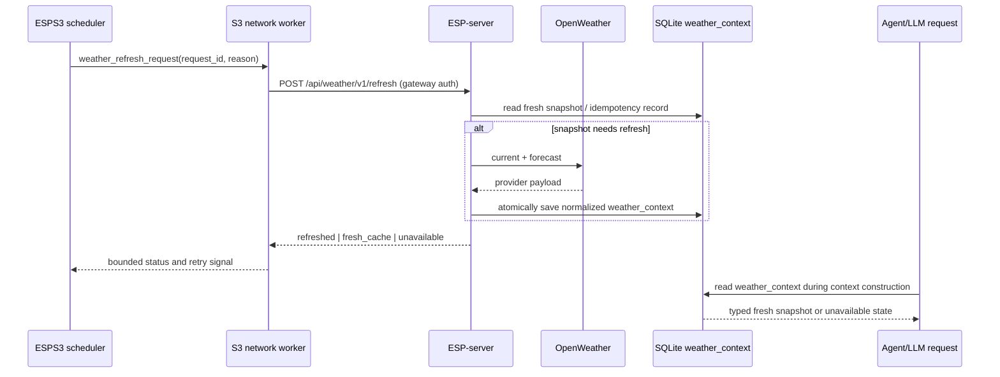

# Weather Context Architecture Audit

Date: 2026-07-20

## Scope And Evidence Boundary

This is a read-only source audit of the current workspace's `ESPS3` and nested
`ESP-server` worktree. No server was started, no SQLite database was changed,
no firmware was built or flashed, and no OpenWeather request was made.

The nested server worktree is on `new1` and includes uncommitted Agent/voice
work. Those files are treated as current working-tree source because they are
registered by `server.js`. An earlier voice-chain audit in this workspace is
stale where it says that voice bypasses the Agent loop.

## Decision

**Yes. A server-owned `weather_context` refreshed by S3 is the better default
for the current architecture than a real-time weather Tool Call on every voice
weather question.** It removes OpenWeather and an extra model round from the
voice critical path, centralizes API quota, makes freshness explicit, and fits
the existing S3-to-server HTTP ownership boundary.

It is not permission to present old weather as live. The LLM may use the
snapshot only while `available=true` and `now < expires_at_ms`; otherwise it
must say that fresh weather is unavailable. A future explicit "refresh now"
feature can use the same server refresh service, but should not be part of the
initial voice path or implemented as an unconstrained model tool.



`S3` requests refresh; it does not own the weather API key, raw provider
payload, freshness calculation, or the authoritative cache.

## Current Architecture

### 1. S3 To ESP-server Channel

| Existing capability | Evidence | Reuse decision |
| --- | --- | --- |
| S3 HTTP client with the full server API boundary | `ESPS3/components/Middlewares/server_client/server_client.h:5-10` | Reuse transport, gateway headers, link gates, and response handling. |
| Managed upload queue and periodic scheduler | `network_worker.h:102-109`; `runtime/s3_scheduler.c:1319-1365` | Reuse trigger cadence and one pending refresh. Do not run HTTP in radar, local HTTP, or scheduler interrupt-facing work. |
| S3 pulls server commands | `command_router.c:405-465`; `ESP-server/src/routes/commandRoutes.js:177-199` | Do not reuse. It is server-owned command delivery to a child device, not S3-originated state refresh. |
| S3 habit-event reporter | `habit_event_reporter.c:63-100`; `server_client.c:1372-1385` | Reuse bounded retry/idempotency lessons, not its endpoint or task. It is one-way event delivery to `/api/habit-events`, while refresh needs a typed synchronous outcome. |
| Authenticated system/alarm event endpoint | `ESP-server/src/routes/eventRoutes.js:51-71,98-127` | Do not encode refresh as a system log. A log is audit data, not a cache mutation contract. |

There is no existing `weather_refresh_request` endpoint, server-client method,
or `network_worker_server_json_type_t` member. The existing physical HTTP path
is reusable; the weather request semantic contract is not.

The current habit-event route also has no `requireGatewayAuth` middleware
(`ESP-server/src/routes/habitEventsRoutes.js:10-23`). It must not become the
weather ingress. The generic gateway middleware understands `X-Gateway-Id`,
`X-Device-Id`, and `X-Gateway-Token`
(`src/services/gatewayAuthService.js:58-79,152-173`) and is the right
middleware for the new endpoint. Production deployment must also close the
current missing-token fail-open behavior (`gatewayAuthService.js:93-101`).

### 2. Context/State Storage

The server already has a singleton `home_location` table with city, district,
coordinates, and timezone (`src/db/homeLocation.js:1-24`), plus a settings API
that writes it (`src/services/homeLocationService.js:80-119`;
`src/routes/settingsRoutes.js:17-42`). This is the correct location source for
a home-scoped weather refresh.

There is no `weather_context` table or weather snapshot in the current source
or SQLite schema. Existing tables are not substitutes:

| Candidate | Why it is not the weather cache |
| --- | --- |
| `event_logs` | Append-only audit record with arbitrary JSON, not a single authoritative state row (`src/db/eventLogs.js:6-54`). |
| `dashboard_snapshots` | Historical S3 uploads, not server-owned external context (`src/db/dashboardSnapshots.js:6-46`). |
| `habit_events` | Rule-event ledger with a different schema (`src/db/habitEvents.js:1-13`). |
| `home_location` | Correct configuration input, but it has no provider result, observation, expiry, or failure state. |

Use a dedicated home-scoped snapshot and a small idempotency ledger:

```text
weather_context
  scope_key TEXT PRIMARY KEY              -- initially 'home'
  location_updated_at TEXT/INTEGER        -- invalidate after location change
  provider TEXT NOT NULL                  -- 'openweather'
  available INTEGER NOT NULL
  observed_at_ms INTEGER
  fetched_at_ms INTEGER NOT NULL          -- server time only
  expires_at_ms INTEGER NOT NULL
  condition_code INTEGER
  condition_key TEXT                      -- allowlisted provider category
  temperature_c REAL
  feels_like_c REAL
  humidity_percent INTEGER
  wind_speed_mps REAL
  precipitation_probability REAL
  sunrise_at_ms INTEGER
  sunset_at_ms INTEGER
  forecast_json TEXT                      -- bounded normalized subset
  last_error_code TEXT
  last_error_at_ms INTEGER
  updated_at_ms INTEGER NOT NULL

weather_refresh_requests
  request_id TEXT PRIMARY KEY
  gateway_id TEXT NOT NULL
  reason TEXT NOT NULL
  received_at_ms INTEGER NOT NULL
  outcome TEXT NOT NULL                   -- refreshed|fresh_cache|unavailable
  context_updated_at_ms INTEGER
  error_code TEXT
```

The second table makes S3's retry safe across a server restart and provides a
small queryable audit record. Retain it for a bounded period. Do not store API
keys, raw coordinates in LLM context, or unbounded provider JSON.

On provider failure, retain the last successful payload for diagnostics but do
not extend `expires_at_ms` or change `observed_at_ms`. At read time, a past
expiry makes the snapshot unavailable. This is the required fail-closed rule.

### 3. Current LLM Context And Tool Loop

The Agent currently constructs two system messages: a fixed system prompt and
JSON dynamic context, then sends the user message
(`src/agent/agentRunner.js:95-105`). Dynamic context includes home location,
device capabilities, and the tool list, but no weather snapshot
(`src/agent/contextBuilder.js:14-32`). The fixed prompt forces
`weather_query` for weather questions
(`src/prompts/esp-home-agent-system-prompt.txt:11-17`).

`weather_query` is a real server-side tool. It reads the saved home location,
calls OpenWeather `/data/2.5/weather`, then `/data/2.5/forecast`, and returns
a normalized answer only in memory (`src/agent/weatherQuery.js:78-138`). It
has an 8-second request timeout by default (`weatherQuery.js:10-21`) but
neither persists a result nor includes observation/expiry metadata.

The model receives the tool schema from `defaultToolRegistry`
(`src/agent/defaultToolRegistry.js:15-31`); the Agent serializes the result as
a `role: tool` message and invokes the model again
(`agentRunner.js:140-180`). The generic Tool Registry only proves that
arguments are JSON objects, not that they satisfy every declared schema
(`src/agent/toolRegistry.js:33-53`).

The current voice route is especially relevant:

- Weather-shaped ASR text is routed to forced `weather_query`
  (`src/voice/agentConversation.js:41-70,122-157`).
- A tool failure is fail-closed for the voice result
  (`agentConversation.js:171-187`).
- Voice allows one active turn and a 45-second total default budget, while the
  forced tool default is 8 seconds (`src/voice/turnConfig.js:5-34`).
- `runAgentConversation()` uses `round <= MAX_TOOL_ROUNDS`, so a configured
  maximum of three can execute four model/tool rounds
  (`src/agent/agentRunner.js:10,109-181`).

The present voice weather answer can cost ASR + first LLM request + OpenWeather
current request + OpenWeather forecast request + second LLM request + TTS. It
also repeats the external call for each voice query. A cached context removes
the weather HTTP calls and model tool round from this critical path.

## How To Reuse `weather_query`

Reuse the provider-facing pieces, not the current handler as the cache API.

1. Keep `home_location` and `readHomeLocation()` as the only home-location
   source. A refresh request must not accept arbitrary coordinates or caller
   supplied locations.
2. Extract `readWeatherConfig()`, `buildOpenWeatherUrl()`,
   `fetchOpenWeather()`, and `mapForecast()` from `weatherQuery.js` into
   `weatherProvider`. Preserve its timeout and fail-closed behavior.
3. Add `weatherContextService.refreshHomeWeather()` around that provider. It
   validates payloads, computes server-side observation/fetch/expiry fields,
   normalizes the bounded snapshot, and performs one database update.
4. Change the existing tool to read a fresh `weather_context` first. For the
   first version it returns `WEATHER_CONTEXT_UNAVAILABLE` on stale/missing
   cache rather than silently doing a real-time request.
5. Let `buildAgentContext()` inject the sanitized snapshot. Update the system
   prompt: fresh context is authoritative only for its cache interval; stale or
   unavailable context must be reported as unavailable; do not force one tool
   call per weather utterance.

Do not pass the existing handler an S3 request directly. It accepts an optional
user-selected location, returns presentation fields, and has no idempotency,
cache write, or refresh provenance.

## Minimal Additions

### S3

Extend the existing scheduler/network-worker/server-client chain rather than
adding a radar-adjacent task:

1. Add one low-priority, coalesced `weather_refresh` work type and
   `server_client_post_weather_refresh_json()`.
2. Add an S3 scheduler gate: enqueue on first `LINK_STABLE`, then only when a
   local cooldown expires (recommended 20 minutes) or after a server response
   reports expired/missing context. Never enqueue per voice turn, radar frame,
   BME sample, or habit event.
3. Permit one pending request. Retry network timeout, connection failure, HTTP
   429, and 5xx with bounded backoff; do not retry 400/401/403 until a
   configuration/auth change. Expose attempts, coalesces, successes, and drops.
4. S3 retains request/cooldown state only. It does not cache weather, parse
   OpenWeather data, or receive the OpenWeather API key.

Using `s3_scheduler_tick()` is consistent with current periodic snapshot,
command-pull, and smart-home enqueue points (`s3_scheduler.c:1319-1365`). The
network worker already owns stable-link gating and queued server work
(`network_worker.h:5-10,102-109`).

### ESP-server

Add only these bounded modules:

| Module | Responsibility |
| --- | --- |
| `src/db/weatherContext.js` | Creates the two tables and indices. |
| `src/services/weatherProvider.js` | Shared OpenWeather transport and strict payload normalization. |
| `src/services/weatherContextService.js` | Freshness, atomic persistence, idempotency, response projection. |
| `src/routes/weatherContextRoutes.js` | Authenticated `POST /api/weather/v1/refresh`; optional authenticated read-only debug endpoint. |
| Existing context builder/prompt | Injects typed snapshot, never raw provider payload. |

Suggested request envelope:

```json
{
  "schema_version": 1,
  "request_id": "weather_01...",
  "reason": "link_stable|ttl_due|server_requested"
}
```

`gateway_id` comes from verified headers, never from the body. The response
includes `outcome`, `available`, `observed_at_ms`, `expires_at_ms`, and a
stable error code, but no provider key or exact home coordinates.

## Failure And Freshness Rules

- The server calculates `fetched_at_ms`, expiry, and freshness decisions. S3
  uptime and provider timestamps cannot refresh a cache by themselves.
- Validate current and forecast payloads before declaring success. A HTTP 200
  payload missing core fields is a failure, not partial success.
- Use a fixed provider policy: current conditions expire after 30 minutes;
  forecast summary is valid only while derived from that fresh fetch.
- An in-flight duplicate returns the stored outcome for the same `request_id`;
  a new request inside the fresh interval returns `fresh_cache` without a new
  OpenWeather call.
- Prompt context exposes `fresh|stale|unavailable`, `observed_at_ms`, and
  selected numeric facts. It must not include provider descriptions verbatim as
  system instruction text. Prefer allowlisted condition code/category.
- Missing API key, missing coordinates, timeout, rate limit, malformed payload,
  or expired cache yields unavailable data. The LLM must not infer weather from
  season, indoor BME readings, or old snapshot fields.

## Why This Beats Per-Voice Real-Time Tools

| Criterion | Persisted Weather Context | Current voice `weather_query` |
| --- | --- | --- |
| Voice latency | One model answer reads local SQLite context. | Forced tool plus at least one extra model request and two serial external HTTP calls. |
| Availability | Last valid snapshot is usable only until expiry; then clear unavailable. | Every weather voice request depends on OpenWeather and Tool Loop success. |
| Cost and rate limits | S3 cadence coalesces refreshes for all voice terminals. | Repeats current and forecast calls for each qualifying utterance. |
| S3 role | Triggers a bounded refresh through its existing uplink. | S3 only proxies the voice request; it has no weather-state role. |
| Auditability | Snapshot provenance, request ID, and last failure are queryable. | Transient tool result reaches the model; weather is not persisted. |
| Safety | Typed bounded fields enter the prompt with freshness semantics. | Provider strings become a tool result after model-selected invocation. |

The context approach is the right baseline for routine weather-aware home
conversation and automation. Direct Tool Calling remains suitable only for a
later explicit freshness override after end-to-end budgets, authentication, and
tool-schema validation are tightened. It should not be the normal path for the
current single-concurrency voice pipeline.

## Verification Plan

Static/source checks cannot prove provider, network, or voice behavior. Before
implementation is accepted, validate separately:

1. Unit-test payload normalization, expiry transitions, idempotent retries,
   location-update invalidation, and failure preservation.
2. API-test gateway authentication, request replay, 429/5xx handling, and
   no-leak responses.
3. Test Agent text, structured, and voice paths: fresh snapshot produces no
   `weather_query`; stale snapshot gives the prescribed unavailable response.
4. S3 host/build tests prove scheduler coalescing, link-down behavior, retry
   classification, and that radar/voice work is not blocked.
5. On hardware and a real server, measure refresh cadence, OpenWeather quota,
   context age, voice time-to-first-PCM, reconnect recovery, and failure logs.

The first four levels do not establish real Wi-Fi, OpenWeather, deployed
credentials, or end-user voice acceptance; those require the final live run.
